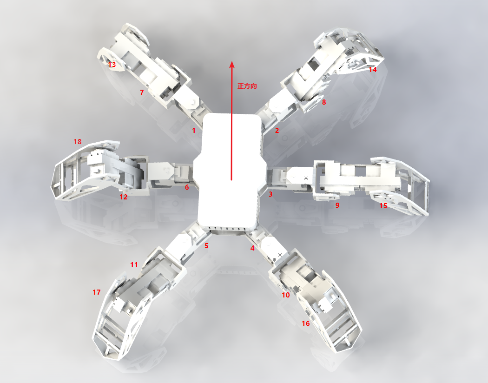
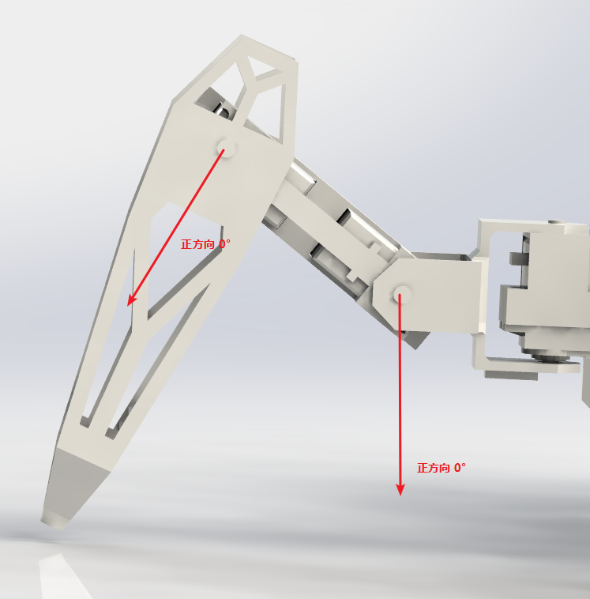

# 六足机器人操控逻辑与函数
## 移动方式
---
    1.平移型移动方式
    2.行走转弯型移动方式
## 舵机编号与角度正方向说明(增长方向为顺时针)
---

## 函数
---
### 误差确认
    1.工程图角度归正
    2.舵机转向修正
    3.舵机正反修正
### 基础函数：  
    1.弧度转角度 
    2.浮点数转为整数
    3.各个关节的长度信息
### 业务函数
    1.平移型移动方式函数与算法：
        线型函数
        状态确认
    2.行走转弯型移动方式函数与算法
        角度滑盘转为弧度线
        引导关节转弯
    3.给定长度与高度，解算三只关节角度
    